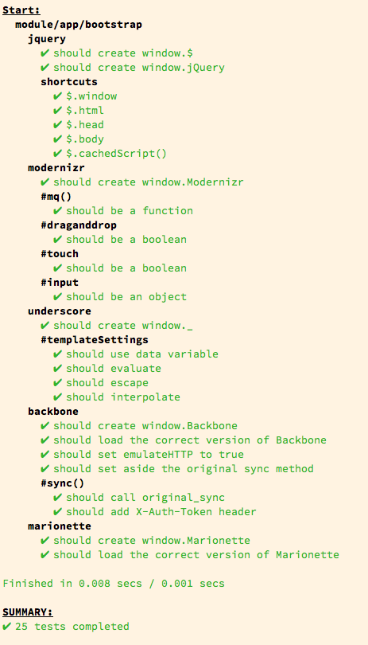
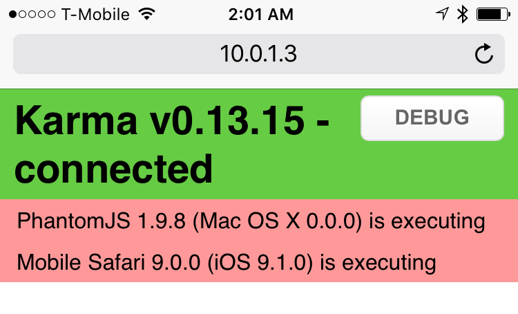
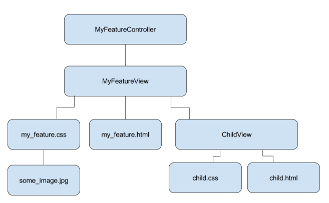

<!-- .slide: data-state="intro" -->
# Writing and Running Tests

Notes:

!!

## Some Caveats

- ### Our tests are a work-in-progress
- ### I’m not an expert
- ### We’re all learning as we go

!!

## Some Vocabulary

### Karma

Our test runner

### Webpack

Our module bundler / compiler

### Mocha

Our testing framework

!!

<!-- .slide: data-state="filesystem" -->
## The Lay of the Land

```
main/
  client/
    config/
    src/
    test/
    package.json
    bower.json
    karma.conf.js
    webpack.config.js
```

!!

## Setting up

```
cd client
npm install
bower install
npm install -g karma-cli webpack
```

!!

<!-- .slide: data-state="testexample" -->
## Running Tests with Karma



`karma start`

- Loads and compiles our tests<br />(using webpack under the hood)
- Starts a webserver on port 9876
- Points one or more browsers at that server
- Any UI created by your tests appears in the browser<br />(except PhantomJS)
- Test results appear in the terminal where karma is running


!

<!-- .slide: data-state="continuous" -->
## Running Tests Continuously

- By default, karma keeps running, waiting for changes
- Save changes, tests rerun automatically
- Incremental recompiles, much faster
- Point any browser at &lt;yourip&gt;:9876
- karma will 'capture' it for testing — even your phone!

!

## Running Tests Once

`karma start --single-run`

- Compiles, runs the tests, and quits

!

## Running Tests In Different Browsers

`KARMA_BROWSERS=Chrome,Safari karma start`

- our config parses the KARMA_BROWSERS environment variable
- Browsers can be: Chrome, Safari, Firefox, or PhantomJS
- Karma just uses PhantomJS by default

!

## Running Tests For Production

`NODE_ENV=production karma start`
- tells webpack to compile for production<br>(minification, dead-code removal, etc)
- tells karma to run once (same as `--single-run`)
- slower, not recommended for development

!!

## Writing tests

!!

# NEEDLE SCRATCH!

!!

## Writing testable code

A few thoughts…

!

### Programming is not writing code

!

### Programming is problem-solving

!

### Every feature is a problem to be solved

!

### Complex problems are solved<br>by breaking them<br>into smaller,<br>simpler<br>problems

!

### …code is just an artifact of the solution

!

### The more you break the problem down,<br>the simpler each code artifact is

!!

## Figuring out the parts

!

## Key questions to ask yourself:

- What are the parts of this feature?
- What are the responsibilities of each part?
- Do any parts have too many responsibilities?
- How can I test each part independently from the others?

!

## A feature is a hierarchy of parts

- A large part which relies on smaller parts
- Those smaller parts might rely on still smaller parts



!

## Breaking apart the parts

- Each part is an independent (requirable) module
- Each part of a feature has one 'job', ideally
- Accomplishing that job might involve telling other smaller parts to do their job
- Ideally, nothing acts of its own volition—<br>some larger part tells it when to do its job

!

## Smaller parts make writing tests easier

!!

## Writing a test suite in mocha

### A suite is a collection of tests

- `describe` an object
    - `it` should
    - `it` should not
- Use nested describe blocks for an object’s properties and methods

!

## Setting up and tearing down

### A test suite should be able to:
- run independently of other suites
- run in conjunction with other suites

!

## before and after

- `before` your tests run, set up requirements
    - instantiate assumed globals (ahem)
    - mock objects
    - require modules needed in your test
- `after` your tests run, tear down anything you set up
    - delete window globals
    - remove dom elements

!

## beforeEach and afterEach

- set up and tear down for each test in your suite
- use these within tests to simplify your test code

!

<!-- .slide: data-state="examplesuite" -->
## An example suite

```
describe('module/foo/foo_view', function() {

    // define vars used throughout your suite
    var FooView
    var foo_view
    var node
    var region

    // don't perform any logic directly in your describes
    // use before and after
    before(function() {
        require('mocks/globals') // sets up a mock globals json glob
        FooView = require('module/foo/foo_view')
        node = $('<div />').appendTo('body')
        region = new Marionette.Region({ el: node })
    })
    after(function() {
        region.destroy()
        node.remove()
    })

    // create a fresh foo_view for each test
    beforeEach(function() {
        foo_view = new FooView()
        region.show(foo_view)
    })

    // describe each part of your view or object

    // write pending tests first, using
    // it('should do something') with no callback
    // implement the test callback later

    describe('#ui', function() {
        describe('#headline', function() {
            it('should exist')
        })
        describe('#button', function() {
            it('should exist')
        })
    })

    describe('#someMethod', function() {
        it('should do something')
        it('should not do something')
    })

})
```

!!

## Implementing test logic with chai

`expect` and `should`

```
var chai = require('chai')
var expect = chai.expect
chai.should()
```

!

## Expect and Should

```
describe('#ui', function() {
    describe('#headline', function() {
        it('should exist', function() {
            expect(foo_view.ui.headline).to.exist
        })
    })
    describe('#button', function() {
        it('should exist', function() {
            foo_view.ui.button.should.exist
        })
    })
})
```

!!

<!-- .slide: data-state="sinon" -->
## Stubbing and spying with sinon

```
var sinon = require('sinon');

describe('MyObject', function() {
    describe('#myMethod', function() {
        it('should call OtherObject.otherMethod', function() {
            sinon.stub(OtherObject, 'otherMethod')
            MyObject.myMethod()
            OtherObject.otherMethod.calledOnce.should.be.true
        })
    })
})
```

!!


## Getting help

- Misery loves company
- Join #fed-testing in Slack
- Use Screenhero to pair with coworkers and write tests together

!!

<!-- .slide: data-state="end" -->
# Happy Testing!
